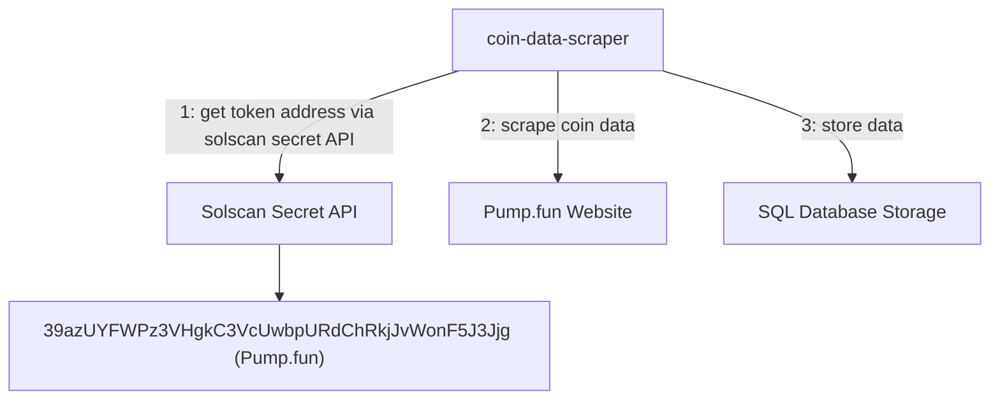

# coin-data-scraper

```mermaid
graph TD
    A["coin-data-scraper"] -->|1: get token address via solscan secret API| B["Solscan Secret API"]
    A -->|2: scrape coin data| C["Pump.fun Website"]
    A -->|3: store data| D["SQL Database Storage"]

    B["Solscan Secret API"] --> E["39azUYFWPz3VHgkC3VcUwbpURdChRkjJvWonF5J3Jjg (Pump.fun)"]
```
