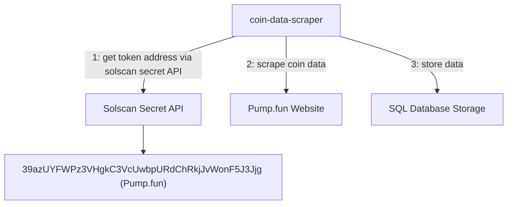

# coin-data-scraper



## Overview

This project provides a web service and data scraping pipeline for coin data collection and analysis. The application includes:

- A litestar-based web service running with Gunicorn and Uvicorn.
- A Streamlit dashboard for visualization.
- A data scraping component for fetching exchange data.

## Prerequisites

- Python 3.12+
- Poetry (for dependency management)
- Systemd (for service management on Linux)

## Installation

1. **Clone the repository**

   ```sh
   git clone https://github.com/your-repo/coin-data.git
   cd coin-data
   ```

2. **Install dependencies**

   ```sh
   poetry install
   ```

3. **Set up environment variables**
   Create a `.env` file in the project root and configure required environment variables:

   ```sh
   cp .env.example .env
   ```

Update the `.env` file with your required settings.

## Running the Web Server

The API server is powered by Gunicorn and Uvicorn. You can start it using:

```sh
make start-service
```

Or manually:

```sh
poetry run gunicorn -k uvicorn.workers.UvicornWorker -w 1 -b 0.0.0.0:8000 coin_data.server.api:app
```

## Running the Streamlit Dashboard

Start the Streamlit app in the background:

```sh
make start-streamlit
```

To stop it:

```sh
make stop-streamlit
```

For production:

```sh
make start-streamlit-prod
```

Stop production instance:

```sh
make stop-streamlit-prod
```

## Running the Scraper

To start the data scraping process:

```sh
make start-scraping
```

Use `--help` to see available options:

```sh
make start-scraping --- --help
```

Extract token data from a specified date:

```sh
make start-scraping --- --date 2025-01-01
```

## Setting Up Systemd Service

To configure the API server to run as a background service:

1. **Create a systemd service file**

   ```sh
   sudo nano /etc/systemd/system/coindata.service
   ```

2. **Add the following configuration**

   ```ini
   [Unit]
   Description=Coin Data Scraper Service
   After=network.target

   [Service]
   WorkingDirectory=/root/coin-data-scraper
   ExecStart=/root/.local/bin/poetry run gunicorn -k uvicorn.workers.UvicornWorker -w 1 -b 0.0.0.0:8000 coin_data.server.api:app
   Restart=always
   LimitNOFILE=100000

   [Install]
   WantedBy=multi-user.target
   ```

3. **Reload and start the service**

   ```sh
   sudo systemctl daemon-reload
   sudo systemctl enable coindata.service
   sudo systemctl start coindata.service
   sudo systemctl status coindata.service
   ```

## Setting Up a Cron Job for the Scraper

To automatically run the scraper every day at **00:01 AM EST (UTC-5)**:

1. Open the crontab editor:

   ```sh
   crontab -e
   ```

2. Add the following line to schedule the scraper (replace `/root/coin-data-scraper` with the actual path where your project is located):

   ```sh
   1 5 * * * /usr/bin/env bash -c 'cd /root/coin-data-scraper && /root/.local/bin/poetry run python coin_data/exchanges/pumpfun/__main__.py >> /var/log/coin_data_scraper.log 2>&1'

   ```

   - `1 5 * * *` → Runs the job at 00:01 AM EST (which is 5:01 AM UTC).
   - `cd /root/coin-data-scraper` → Navigate to the project directory.
   - `poetry run python coin_data/exchanges/pumpfun/__main__.py` → Run the scraper.
   - `>> /var/log/coin_data_scraper.log 2>&1` → Log output for debugging.

3. Save and exit the crontab.
4. Verify the cron job is scheduled:

   ```sh
   crontab -l
   ```

5. To check logs:

   ```sh
   tail -f /var/log/coin_data_scraper.log
   ```

## Exporting Dependencies

To generate a `requirements.txt` file:

```sh
make export
```

## Author

Hju Kneyck Flores (<hjucode@gmail.com>)
